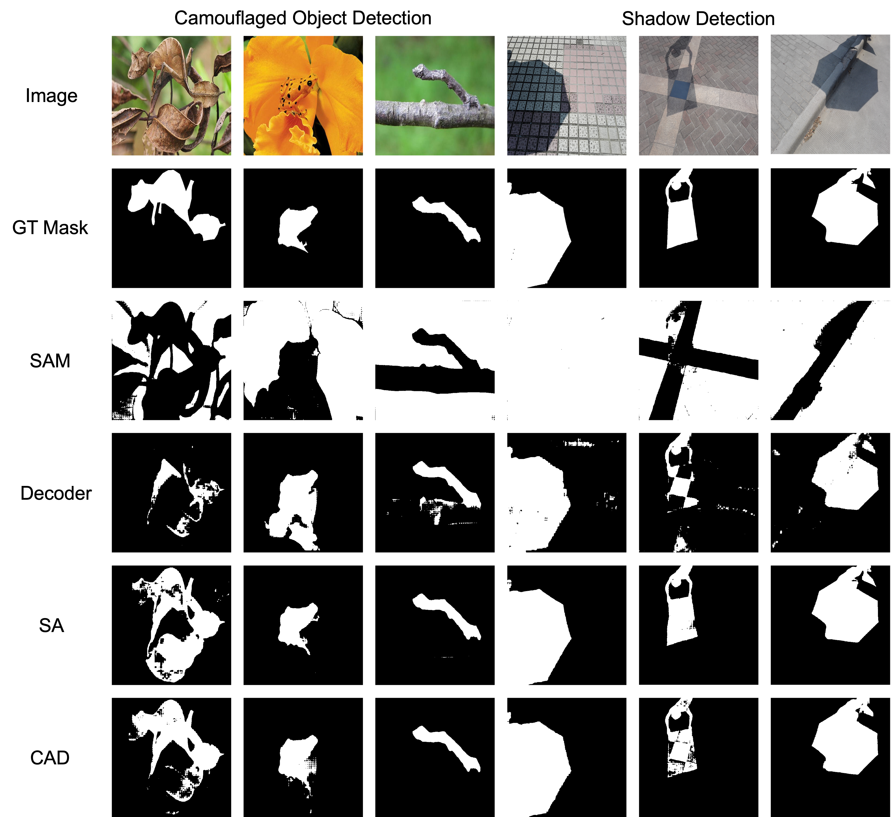

# CAD : Memory Efficient Convolutional Adapter for Segment Anything

Joohyeok Kim, Joonhyeon Song, Seohwan Yun, Seongho Yoon, Sangmin Lee

AIaaS Laboratory, Kwangwoon University

## Abstract 

> The Foundation model for image segmentation, Segment Anything (SAM), has been actively researched in various fields since its proposal. Various researches have been proposed to adapt SAM to specific domains, with one notable approach involving the addition and training of lightweight adapter modules. While adapter-based fine-tuning approaches have reported parameter efficiency and significant performance improvements, they face a often overlooked issue: the excessive consumption of GPU memory relative to the number of trainable parameters. Addressing this issue, this paper proposes a memory-efficient parallel convolutional adapter architecture. This architecture connects in parallel with SAM's image encoder, eliminating the need to store activations and gradients of the image encoder during model training. Our proposed architecture demonstrated competitive experimental results while using less than half the GPU memory compared to SAM Adapter, indicating its value as an alternative to simple decoder fine-tuning when hardware limitations preclude adapter-based learning.

## Overview





We proposed memory efficient convolutional adapter architecture for Segment Anything (SAM). This architecture connects in parallel with SAM's image encoder, eliminating the need to store activations and gradients of the image encoder during model training.

## Environment

```bash 
# create a virtual env and activate
conda create -n cad python=3.8
conda activate cad 

# download packages
pip install -r requirements.txt 
```

## How to Use 

### Train 

- Move to ```code/``` directory
- [Download the checkpoint](https://github.com/facebookresearch/segment-anything?tab=readme-ov-file#model-checkpoints) for Segment Anything corresponding to the model type(e.g., ```vit_b```).
- Inside ```run.sh```, set the appropriate dataset path 
- You can check the meaning of each argument in argparse at the top of ```run_cad.py```, ```run_sa.py```
- Running ```./run.sh``` will train the both model

All training processes are logged using **WandB(Weights & Biases)**. To modify the wandb project name, modify the ```--project_name``` argument.

### Test

After model training is complete, the model weights are saved under the ```checkpoints/``` directory. The weight file name is saved based on the execution time (e.g., ```May21_172910.pth```). Rename this file to ```sam_cad.pth``` and ```sam_sa.pth```.

If you want to evaluate the trained model, set the test dataset path inside ```eval.sh```, then run the ```./eval.sh```.

## Dataset 

We utilized two challenging tasks: Shadow detection and Camouflaged object detection.

### Camouflaged Object Detection
- [COD10K](https://dengpingfan.github.io/pages/COD.html)
- [CAMO](https://sites.google.com/view/ltnghia/research/camo)

### Shadow Detection 
- [ISTD](https://github.com/DeepInsight-PCALab/ST-CGAN)
